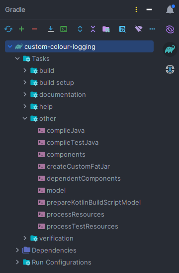

# custom-colour-slf4j-log   
Project to demonstrate custom color of log with SLF4J library.   

Sample output:   
   

## Custom Gradle Task    
Below is a custom gradle task added in build.gradle file.
```
task createCustomFatJar(type: Jar) {
    manifest {
    attributes  'Implementation-Version': version,
    'Implementation-Title': 'Gradle Jar create Task',
    'Main-Class': 'com.custom.colour.msg.print.MessagePrinter'
    }
    archiveBaseName = project.name + '-core'
    duplicatesStrategy = DuplicatesStrategy.EXCLUDE
    from { configurations.runtimeClasspath.collect { it.isDirectory() ? it : zipTree(it) } }
    with jar
}

```
## Run Custom Gradle Task from IntellJ
From IntelliJ you can run the custom task under Tasks &rarr; Other &rarr; createCustomFatJar   


## Run Custom Gradle Task using command     
Format: gradle tasks <task-name>   
gradle tasks createCustomFatJar
